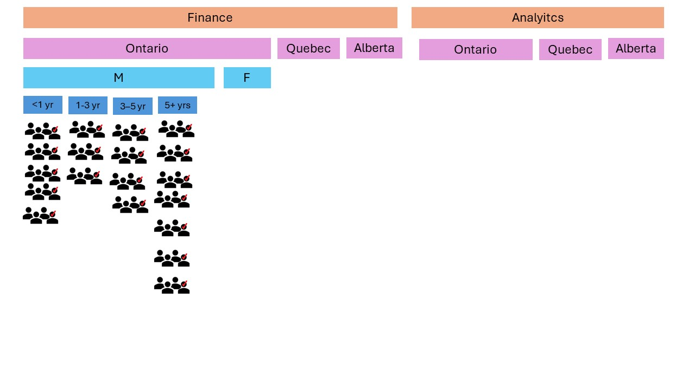

# Assignment: Questionnaire Design (Part B)

## Requirements
1. Comment on the quality of your sample. Do you expect it to be representative of your target population? Why or why not?

    ```
    The way stratified random sampling was proposed for the sampling will ensure the survey to be representative of the target population. They stratas were created on the basis of multiple demographic variables like department, location, gender and length of stay in the company. 
    There are still few variables that can be added to make improve the representativeness further. Those are mentioned in the next question. 
    ```

2. Given the class content (error, survey quality, ethics) covered since Part A of the assignment, do you wish to make any changes to your original survey? If so, make a copy of your original survey and make any desired changes. Describe the changes and your reasoning. Provide a link here for submission.

    ```
    The error that we expect here is the sampling error. We can avoid this error by two methods. 
        1. Survey all the company employees. It would be ideal to make the sampling size same as frame size. It will reduce the error i.e. will improve the accuracy of our results but on the other end, it will add up time taken to complete the survey and to compile the survey results. 
        2. 2nd idea that we can implement is to implement an exit survey, i.e. to survey only those employees who are leaving the company, but that will add bias in the results because of the higher number of unsatisfied employees. 
    2nd option would not be recommended because of additional bias error and 1st option would increase the time and budget of the study. 
    
    Another potential source of error would be non-responsive error, it can be reduced by building trust among employees while ensuring that the survey will remain be anonymous with no tracking on any personally identifiable information. Employees will also be motivated for greater participation by spreading the message that the leadership is serious in brining in change that will ultimately help employees as well company. 
    
    
    Changes Proposed: 
    Original strategy: 
    
    For the said study, we will use stratified random sampling. Strata will be created based on department, location, gender and length of stay in the company. 
    
    New proposal: 
    Instead of stratified random sampling, we would recommend stratified systematic samples. Sampling will be based on multi-factor strata based on department, location, gender whereas the length of stay in the company  will be used for systematic sampline within the strata. The sample from each strata will be taken as 4th members of each strata, based on the length of stay in the company. Hence, the sampling population will comprised of 25% of employees. 
    
    

    

    Question number 2 in section-A need to be modified. 
    Original strategy: 
        Section-A. Demographics: 
        2. How long you have been working with the company? 
    
    Instead of this question to be given as a freeform answer, we will make it more error free as follows 
        Section-A. Demographics: 
        2. How long you have been working with the company? 
            a. <1 year 
            b. Between 1 to 3 years 
            c. Between 3 to 5 years 
            d. More than 5 years 
    ```

3. Could the purpose of your survey have been fulfilled through an observational study? If yes, how? If no, why not?

    ```
    Although their may be some data that could be beneficial for understanding employee satisfaction and turnover rate but those might not be sufficient enough to generate concrete results. Some observation that may be useful are 
        - Absenteeism rate 
        - Employee referrals submitted 
        - Employee engagement (in meetings and corporate initiatives etc) 
    
    Those observational measures may not be sufficient hence I think that the required results may not be achievable through observational study and survey would be a better tool to get the most probable reason behind employee churn.
    ```

## Why am I doing this assignment?

This assignment supports learning outcomes 1, 2, 3, and 4:
	1.	Develop ability to implement simple probability samples.
	2.	Understand more complicated sampling procedures and the tradeoffs involved.
	3.	Identify and understand sources of error or inaccuracies in data as a result of sampling strategies.
	4.	Develop intuition around survey quality.

## Rubric

-	All required components are present and complete **Complete / Incomplete**
-	Assessment of representativeness is justified based on class content **Complete / Incomplete**
-	Changes to original survey are justified based on class content and best practices for sampling **Complete / Incomplete**

## Submission Information

🚨 **Please review our [Assignment Submission Guide](https://github.com/UofT-DSI/onboarding/blob/main/onboarding_documents/submissions.md)** 🚨 for detailed instructions on how to format, branch, and submit your work. Following these guidelines is crucial for your submissions to be evaluated correctly.

### Submission Parameters:
* Submission Due Date: `HH:MM AM/PM - DD/MM/YYYY`
* The branch name for your repo should be: `questionnaire-b`
* What to submit for this assignment:
    * This markdown file (questionnaire_design_part_b.md) should be populated and should be the only change in your pull request.
* What the pull request link should look like for this assignment: `https://github.com/<your_github_username>/sampling/pull/<pr_id>`
    * Open a private window in your browser. Copy and paste the link to your pull request into the address bar. Make sure you can see your pull request properly. This helps the technical facilitator and learning support staff review your submission easily.

Checklist:
- [ ] Create a branch called `questionnaire-b`.
- [ ] Ensure that the repository is public.
- [ ] Review [the PR description guidelines](https://github.com/UofT-DSI/onboarding/blob/main/onboarding_documents/submissions.md#guidelines-for-pull-request-descriptions) and adhere to them.
- [ ] Verify that the link is accessible in a private browser window.

If you encounter any difficulties or have questions, please don't hesitate to reach out to our team via our Slack at `#cohort-3-help`. Our Technical Facilitators and Learning Support staff are here to help you navigate any challenges.
